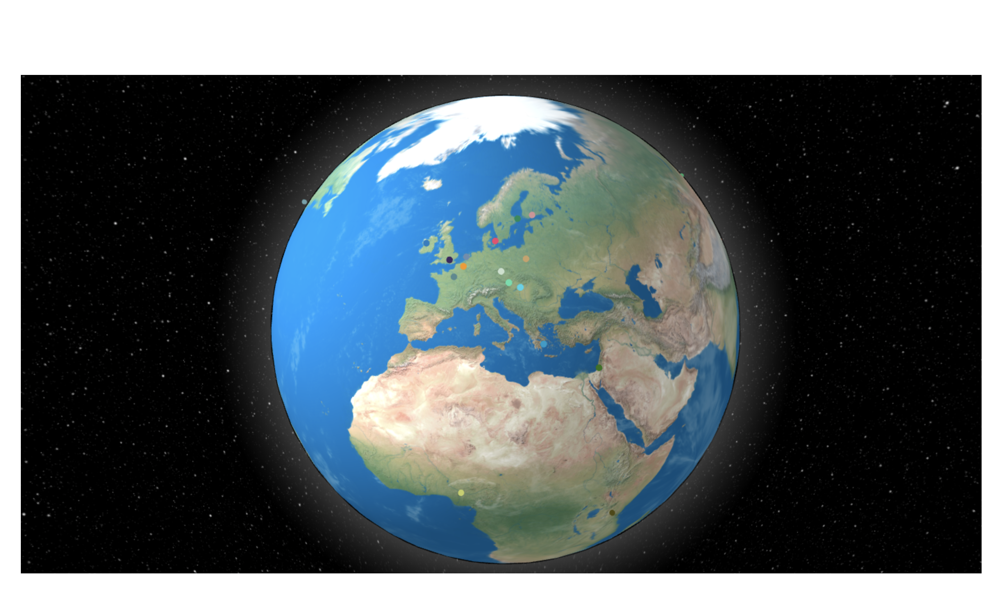
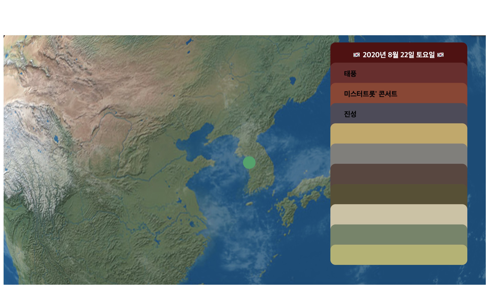

##### We belong to DSC EWHA(2019-2020)

# ReactGlobe 🌎

#### 
  if click the marker of KOREA (2020.08.22 15:00) 
  
  

## Used
* React.js + Node.js + Google Translate API

## Development goal
A website that crawls the world's hottest news in real time,  
translates it into Korean, and provides it.

## Run script in local
* install dependencies (ex:three.js,emoji-flag,etc...)
1) npm install
2) npm start
(localhost will run at port 3000)  
    - if you want to build on server  
    2-1) yarn build  
    2-2) npx serve -s build  
    (localhost will run at port 5000)  
    
If you want contact us, email to planetearth.dsc@gmail.com or lhky0708@gmail.com 😊😊
